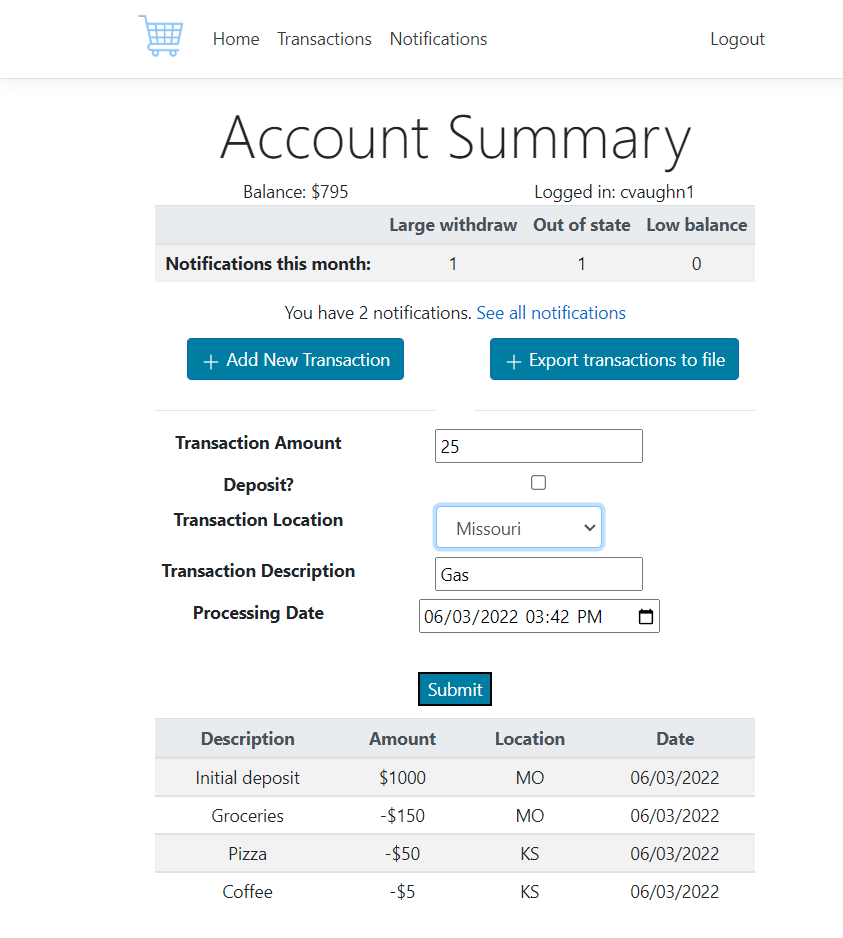
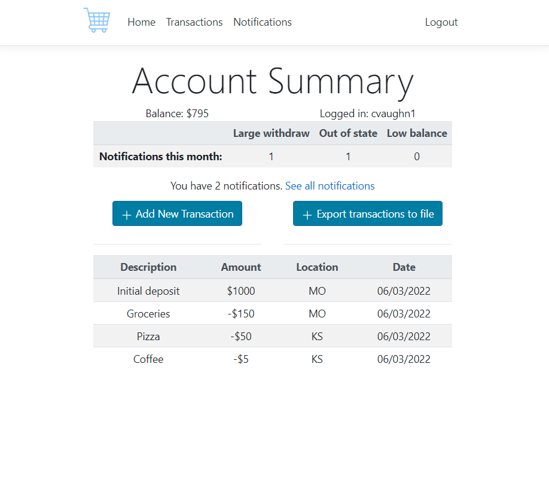
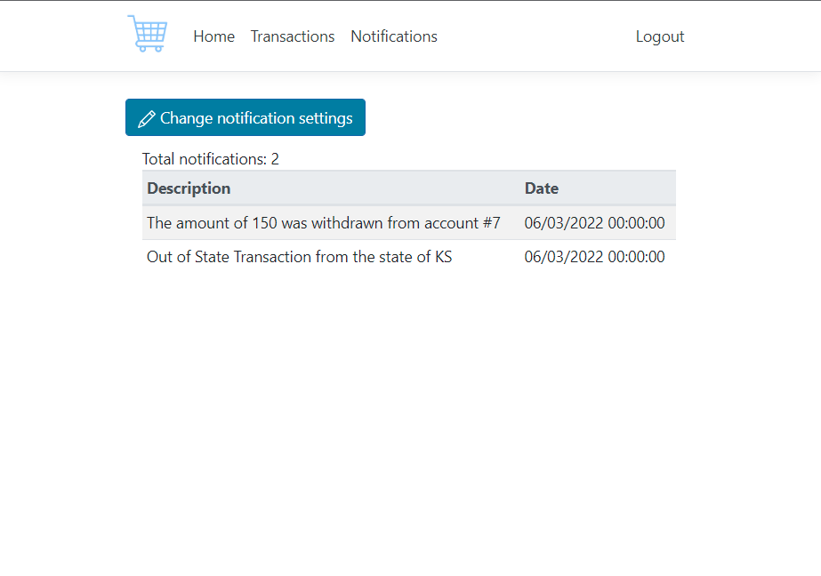

# TransactionApp
Allows users to add new transactions to their account, and get notifications.
Uses ASPNET Core, SQL Server, and Docker.

# Features
* Users can login/register an account (a secure password is required).
* The user's balance changes as they add transactions
* The user can receive notifications when their balance is low, or when a large/out-of-state transaction is added.

# Screenshots
<table>
  <tr>
    <td valign="top"></td>
    <td valign="top"></td>
    <td valign="top"></td>
  </tr>
</table>
